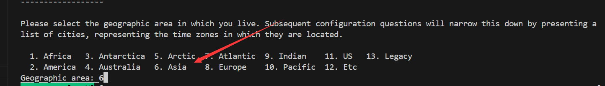
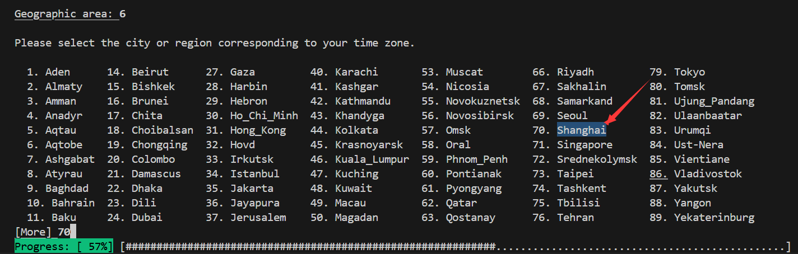
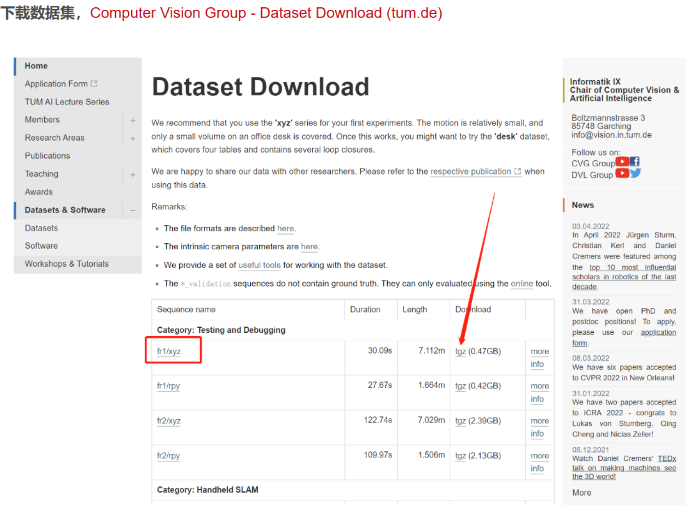
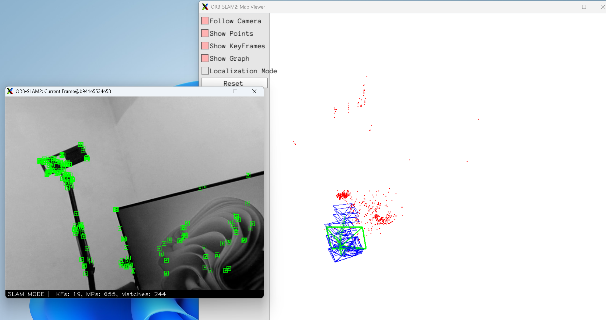
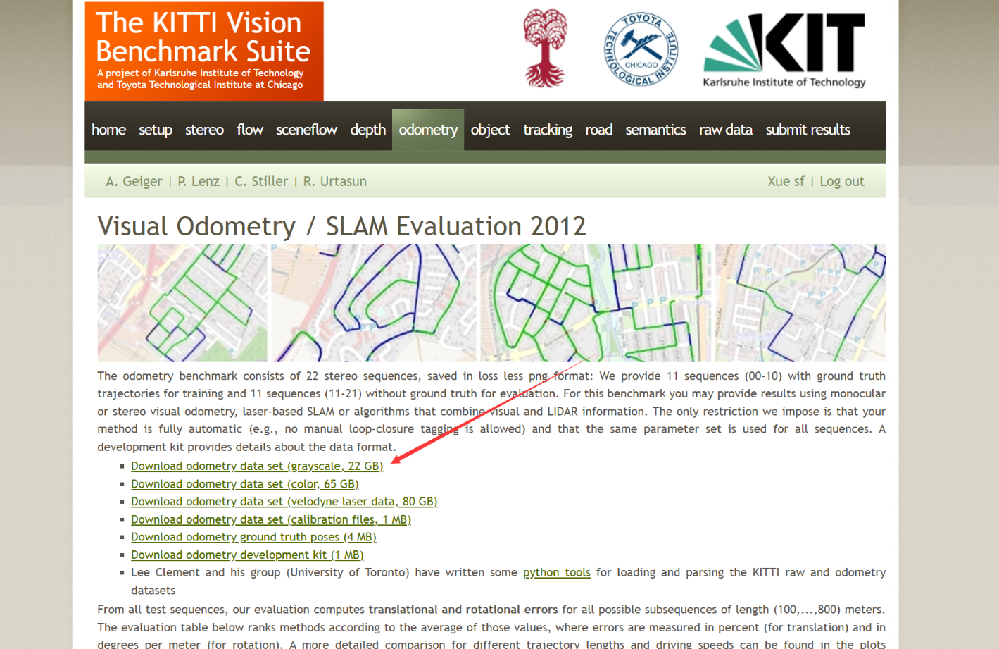
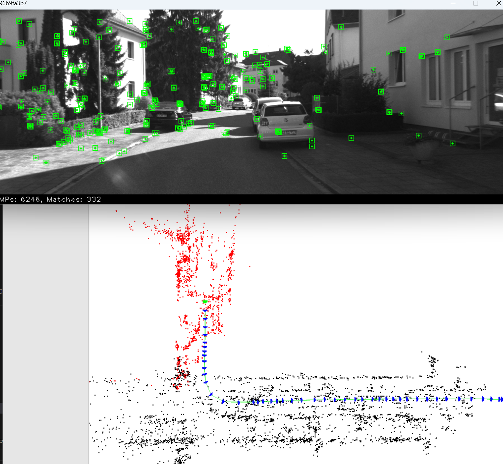

# 前言

本文介绍ORB-SLAM2的编译运行环境。

> ubuntu:22.04
> ros2:humble

# 编译环境搭建

```shell
## 安装ros2和anaconda
apt update

# 按照鱼香ros一键安装完整的ros2【必须安装】
wget http://fishros.com/install -O fishros && bash fishros

```

> ⚠️注意：如果遇到区域选择的问题，一定要要选择亚洲-上海，否则会因为时间不同步的问题导致vcpkg安装库失败






```shell
# 打开新的终端，安装gz
sudo apt-get update
sudo apt-get install curl lsb-release gnupg -y
sudo curl https://packages.osrfoundation.org/gazebo.gpg --output /usr/share/keyrings/pkgs-osrf-archive-keyring.gpg
echo "deb [arch=$(dpkg --print-architecture) signed-by=/usr/share/keyrings/pkgs-osrf-archive-keyring.gpg] http://packages.osrfoundation.org/gazebo/ubuntu-stable $(lsb_release -cs) main" | sudo tee /etc/apt/sources.list.d/gazebo-stable.list > /dev/null

sudo apt-get update -y
sudo apt-get install gz-harmonic -y

# 安装远程显示服务程序
apt install x11-xserver-utils libxcb* -y

# 安装moveit
apt install ros-${ROS_DISTRO}-moveit* -y

# 安装ros2的控制功能包
sudo apt install ros-${ROS_DISTRO}-controller-manager -y
sudo apt install ros-${ROS_DISTRO}-joint-trajectory-controller -y
sudo apt install ros-${ROS_DISTRO}-joint-state-broadcaster -y
sudo apt install ros-${ROS_DISTRO}-diff-drive-controller -y

# 安装其他功能包
apt install ros-${ROS_DISTRO}-ros-gz -y #ros_gz
apt-get install ros-${ROS_DISTRO}-joint-state-publisher-gui -y
apt install ros-${ROS_DISTRO}-moveit-ros-planning-interface -y
# apt install ros-jazzy-gz-ros2-control 这个很重要 https://github.com/ros-controls/gz_ros2_control
apt install ros-${ROS_DISTRO}-gz-ros2-control* -y

python3 -m venv ~/ros2_env 
source ~/ros2_env/bin/activate

pip install pyyaml distro-info distro jinja2 typeguard

apt install x11-xserver-utils libxcb* ffmpeg libavcodec-dev libavutil-dev libavformat-dev libswscale-dev libboost-dev libboost-thread-dev libboost-filesystem-dev libpng-dev nasm libeigen3-dev libglfw3-dev gnome-settings-daemon metacity nautilus gnome-terminal ubuntu-desktop build-essential curl zip unzip tar libgl1-mesa-dev libglu1-mesa-dev freeglut3-dev libegl1-mesa-dev -y

git config --global --unset http.proxy
git config --global --unset https.proxy

sudo apt install libx11-dev libxft-dev libxext-dev nasm libxmu-dev libxi-dev libgl-dev bison libxtst-dev libgles2-mesa-dev python3-jinja2 meson libxkbcommon-dev libxkbcommon-x11-dev libpcre3 libpcre3-dev libgtk2.0-dev libdbus-glib-1-dev -y
```

```shell
cd /opt
git clone --recursive https://github.com/Microsoft/vcpkg.git
cd vcpkg
./bootstrap-vcpkg.sh
./vcpkg integrate install

git pull
./vcpkg update
```


❇️创建软链接

```shell
# 创建软链接
ln -s /opt/vcpkg/vcpkg /usr/bin/vcpkg

# 删除软链接
# rm -rf /usr/bin/vcpkg
```

## Sophus

```shell
# 要打开科学上网
vcpkg install sophus 
```

## Eigen

```shell
# 要打开科学上网
vcpkg install eigen3 
```

## Pangolin

```shell
# 要打开科学上网
vcpkg install pangolin
```

## OpenCV

```shell
# 要打开科学上网
# vcpkg search opencv
vcpkg install opencv3 # 可能报错，可多次尝试
```

## Paho
```shell
vcpkg install paho-mqttpp3
# vcpkg install console-bridge
```

## Tinyxml2
```shell
vcpkg install tinyxml2
```


# ORB-SLAM2测试

❇️编译ORB-SLAM2

```shell
cd /root/workspace/slamsoftware/thirdparty/ORB_SLAM2
chmod +x build.sh
# 注意，编译的时候，把所有的conda环境都取消激活
./build.sh
```
## 单目

### 公共数据集

❇️下载数据集

[https://cvg.cit.tum.de/data/datasets/rgbd-dataset/download](https://cvg.cit.tum.de/data/datasets/rgbd-dataset/download)



❇️运行测试

```shell
cd /root/workspace/slamsoftware/thirdparty/ORB_SLAM2
./Examples/Monocular/mono_tum ../Vocabulary/ORBvoc.txt ./Examples/Monocular/TUM1.yaml /root/workspace/downloads/rgbd_dataset_freiburg1_xyz
```

### 自己标定的摄像头获得的数据集

✅自己标定的摄像头测试

参数文件
```yaml
%YAML:1.0

#--------------------------------------------------------------------------------------------
# Camera Parameters. Adjust them!
#--------------------------------------------------------------------------------------------

# Camera calibration and distortion parameters (OpenCV) 
Camera.fx: 494.77579057
Camera.fy: 495.12742678
Camera.cx: 341.29224035
Camera.cy: 253.3634736

Camera.k1: 0.04370886
Camera.k2: 0.21788909
Camera.p1: 0.01529679
Camera.p2: -0.0001347
Camera.k3: -0.59914976

# Camera frames per second 
Camera.fps: 30.0

# Color order of the images (0: BGR, 1: RGB. It is ignored if images are grayscale)
Camera.RGB: 1

#--------------------------------------------------------------------------------------------
# ORB Parameters
#--------------------------------------------------------------------------------------------

# ORB Extractor: Number of features per image
ORBextractor.nFeatures: 1000

# ORB Extractor: Scale factor between levels in the scale pyramid 	
ORBextractor.scaleFactor: 1.2

# ORB Extractor: Number of levels in the scale pyramid	
ORBextractor.nLevels: 8

# ORB Extractor: Fast threshold
# Image is divided in a grid. At each cell FAST are extracted imposing a minimum response.
# Firstly we impose iniThFAST. If no corners are detected we impose a lower value minThFAST
# You can lower these values if your images have low contrast			
ORBextractor.iniThFAST: 20
ORBextractor.minThFAST: 7

#--------------------------------------------------------------------------------------------
# Viewer Parameters
#--------------------------------------------------------------------------------------------
Viewer.KeyFrameSize: 0.05
Viewer.KeyFrameLineWidth: 1
Viewer.GraphLineWidth: 0.9
Viewer.PointSize:2
Viewer.CameraSize: 0.08
Viewer.CameraLineWidth: 3
Viewer.ViewpointX: 0
Viewer.ViewpointY: -0.7
Viewer.ViewpointZ: -1.8
Viewer.ViewpointF: 500
```

❇️运行测试

```shell
cd /root/workspace/slamsoftware/thirdparty/ORB_SLAM2
./Examples/Monocular/mono_tum ../Vocabulary/ORBvoc.txt ./configs/Monocular/FishEye.yaml /root/workspace/downloads/record_video
```



## 双目

❇️下载数据集

[https://www.cvlibs.net/datasets/kitti/eval_odometry.php](https://www.cvlibs.net/datasets/kitti/eval_odometry.php)



❇️运行测试

```shell
cd /root/workspace/slamsoftware/thirdparty/ORB_SLAM2
./Examples/Stereo/stereo_kitti ../Vocabulary/ORBvoc.txt Examples/Stereo/KITTI00-02.yaml /root/workspace/downloads/Kitti/sequences/00
```


