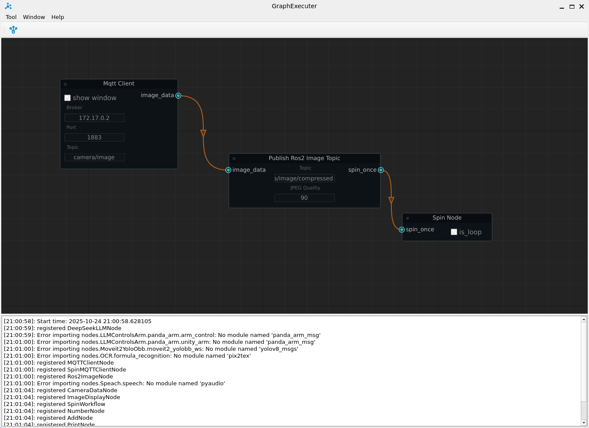
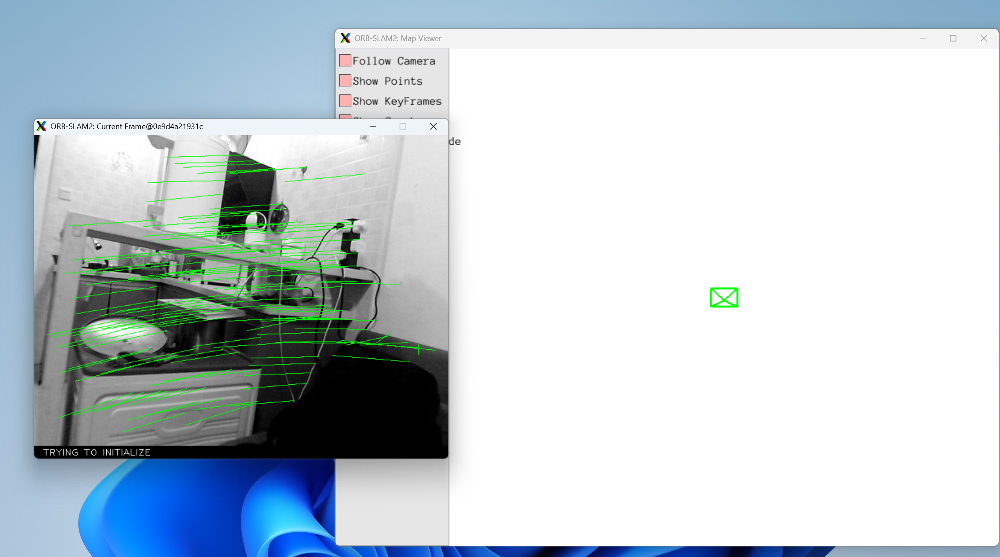
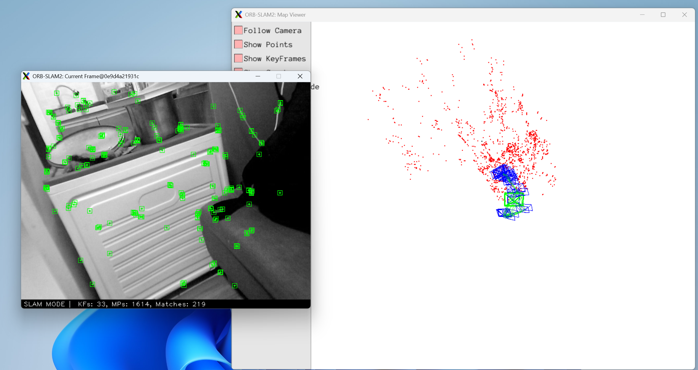

# 前言

介绍ORB-SLAM2的运行测试环境。

# 编译ORB-SLAM2

```shell
conda deactivate
conda deactivate
cd /root/workspace/thirdparties/ORB_SLAM2
./build.sh
```

# 编译ros2_project

```shell
# 注意，编译的时候，把所有的conda环境都取消激活
cd /root/workspace/ros2_project
colcon build
```

# 运行测试

1、运行GraphExecuter

```shell
# 打开新的终端
conda activate visual_slam
cd /root/workspace/GraphExecuter/graph_executer
python3 main.py
```



2、运行ORB_SLAM2

```shell
# 打开新的终端
conda deactivate
conda deactivate
cd /root/workspace/ros2_project
source install/setup.bash

export LD_LIBRARY_PATH=$LD_LIBRARY_PATH:/root/workspace/thirdparties/DBoW2/lib
export LD_LIBRARY_PATH=$LD_LIBRARY_PATH:/root/workspace/thirdparties/g2o/lib
export LD_LIBRARY_PATH=$LD_LIBRARY_PATH:/root/workspace/thirdparties/ORB_SLAM2/lib

ros2 run slam_system monocular_fisheye
```



