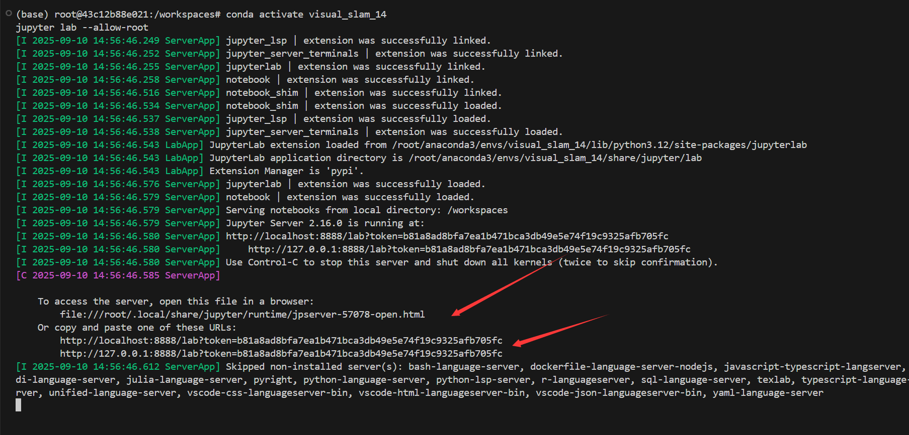
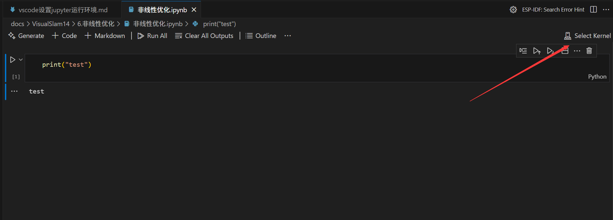
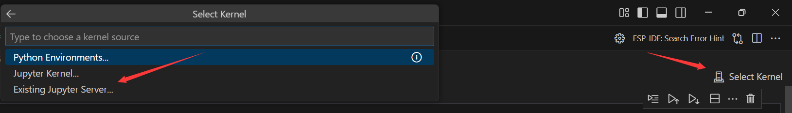
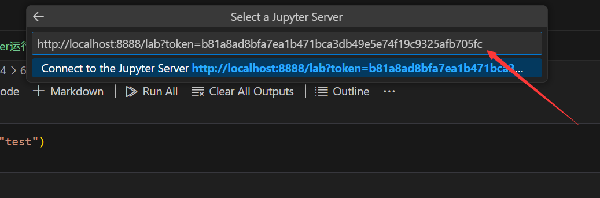
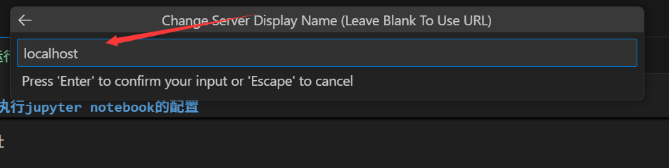
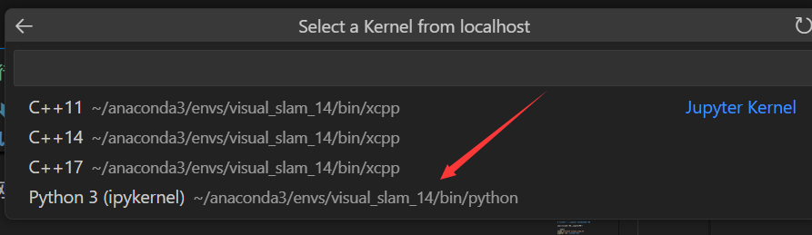
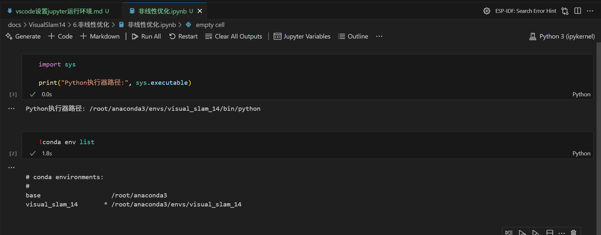

# 前言

本文设置在vscode软件中运行jupyter notebook，并使用C++/python语言进行编程。

# 配置jupyter-notebook环境

- [Ubuntu下安装Anaconda的步骤（带图）](https://zhuanlan.zhihu.com/p/426655323)
- [jupyter notebook 安装 C/C++ kernel](https://zhuanlan.zhihu.com/p/82025119)
- [如何在Anaconda中为jupyter安装扩展Nbextensions插件](https://zhuanlan.zhihu.com/p/335810405)


```shell
# 安装Ananconda 
cd /root/workspace/downloads
wget https://repo.anaconda.com/archive/Anaconda3-2025.06-0-Linux-x86_64.sh

chmod +x Anaconda3-2025.06-0-Linux-x86_64.sh
bash Anaconda3-2025.06-0-Linux-x86_64.sh

# 创建虚拟环境
conda create -n visual_slam_14 python=3.12 -y

# 切换到新创建的虚拟环境
conda activate visual_slam_14

# 安装jupyter notebook
conda install jupyter notebook -y
conda install jupyter_contrib_nbextensions -y

# 安装C++ kernel
conda install xeus-cling -c conda-forge -y

# 检查是否成功安装了kernel
jupyter kernelspec list

# 运行jupyter notebook
conda activate visual_slam
jupyter notebook --allow-root
# 或者启动lab【有目录】
jupyter lab --allow-root

# 测试代码
#include <iostream>
#std::cout << "Hello world!" << std::endl;
```

# vscode中执行jupyter notebook的配置

1、在vscode中运行jupyter服务

```shell
conda activate visual_slam_14
jupyter lab --allow-root
```



获取服务地址

```shell
http://localhost:8888/lab?token=b81a8ad8bfa7ea1b471bca3db49e5e74f19c9325afb705fc
```

2、打开jupyter notebook文件，并选择内核



3、输入以上网址







再回车，然后寻找内核




4、效果


