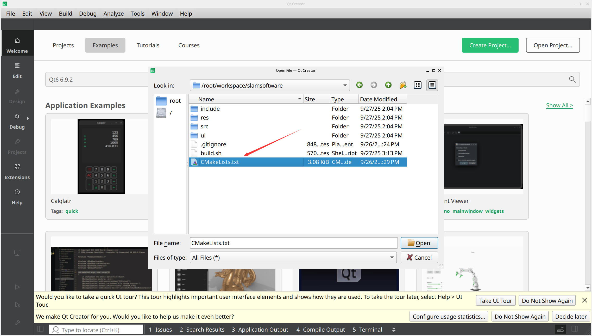

# Qt运行环境

```shell
apt update
pip install pyyaml distro-info distro

# 按照鱼香ros一键安装完整的ros2
wget http://fishros.com/install -O fishros && bash fishros

# 安装Ananconda 
cd /root/workspace/downloads
wget https://repo.anaconda.com/archive/Anaconda3-2025.06-0-Linux-x86_64.sh

chmod +x Anaconda3-2025.06-0-Linux-x86_64.sh
bash Anaconda3-2025.06-0-Linux-x86_64.sh

# 创建虚拟环境
conda create -n visual_slam python=3.12 -y

# 切换到新创建的虚拟环境
conda activate visual_slam

# 安装jupyter notebook
conda install jupyter notebook -y
conda install jupyter_contrib_nbextensions -y

# 安装C++ kernel
conda install xeus-cling -c conda-forge -y

# 检查是否成功安装了kernel
jupyter kernelspec list

pip install pyyaml distro-info distro

unminimize 

apt install x11-xserver-utils libxcb* ffmpeg libavcodec-dev libavutil-dev libavformat-dev libswscale-dev libboost-dev libboost-thread-dev libboost-filesystem-dev libpng-dev nasm libeigen3-dev libglfw3-dev gnome-settings-daemon metacity nautilus gnome-terminal ubuntu-desktop build-essential curl zip unzip tar -y

cd /root/workspace/downloads
wget https://d13lb3tujbc8s0.cloudfront.net/onlineinstallers/qt-online-installer-linux-x64-4.10.0.run
chmod +x qt-online-installer-linux-x64-4.10.0.run
./qt-online-installer-linux-x64-4.10.0.run

# 创建软链接
ln -s /opt/Qt/Tools/QtCreator/bin/qtcreator /usr/bin/qtcreator

# 删除软链接
# rm -rf /usr/bin/qtcreator

# 设置图标放大倍数
export QT_SCALE_FACTOR=1.8
echo "export QT_SCALE_FACTOR=1.8" >> ~/.bashrc
source ~/.bashrc
# qtcreator & # 加&表示后台运行

# 启动
qtcreator

# 取消代理（Failed to connect to 127.0.0.1 port 1008）
# cd /workspace
git config --global --unset http.proxy
git config --global --unset https.proxy

# 使用代理
# git config --global http.proxy "http://127.0.0.1:7890"
# git config --global https.proxy "http://127.0.0.1:7890"
```

# QtCreator打开项目



# ORB-SLAM2运行环境

```shell
cd /opt
git clone --recursive https://github.com/Microsoft/vcpkg.git
cd vcpkg
./bootstrap-vcpkg.sh
./vcpkg integrate install

git pull
./vcpkg update
sudo apt install libx11-dev libxft-dev libxext-dev nasm libxmu-dev libxi-dev libgl-dev bison libxtst-dev libgles2-mesa-dev python3-jinja2 meson libxkbcommon-dev libxkbcommon-x11-dev libpcre3 libpcre3-dev libgtk2.0-dev libdbus-glib-1-dev -y

pip install jinja2
```

❇️创建软链接
```shell
# 创建软链接
ln -s /opt/vcpkg/vcpkg /usr/bin/vcpkg

# 删除软链接
# rm -rf /usr/bin/vcpkg
```

```shell
# 在CMakeLists.txt中设置，要放到project之前
set(CMAKE_TOOLCHAIN_FILE "/opt/vcpkg/scripts/buildsystems/vcpkg.cmake")
```

## OpenCV

```shell
# vcpkg search opencv
vcpkg install opencv3 # 有可能报错，可多次尝试
```

## Sophus

```shell
vcpkg install sophus 
```

## Pangolin

```shell
vcpkg install pangolin 

# 手动安装
git clone https://github.com/stevenlovegrove/Pangolin.git
cd Pangolin
mkdir build && cd build
cmake
make -j$(nproc)
sudo make install
```

## Eigen

```shell
vcpkg install eigen3 
```


# ORB-SLAM2测试

❇️编译ORB-SLAM2

```shell
cd /root/workspace/slamsoftware/thirdparty/ORB_SLAM2
chmod +x build.sh
./build.sh
```
## 单目
❇️下载数据集

[https://cvg.cit.tum.de/data/datasets/rgbd-dataset/download](https://cvg.cit.tum.de/data/datasets/rgbd-dataset/download)


❇️运行测试

```shell
cd /root/workspace/slamsoftware/thirdparty/ORB_SLAM2
./Examples/Monocular/mono_tum ../Vocabulary/ORBvoc.txt ./Examples/Monocular/TUM1.yaml /root/workspace/downloads/rgbd_dataset_freiburg1_xyz
```

## 双目

❇️下载数据集

[https://www.cvlibs.net/datasets/kitti/eval_odometry.php](https://www.cvlibs.net/datasets/kitti/eval_odometry.php)


❇️运行测试

```shell
cd /root/workspace/slamsoftware/thirdparty/ORB_SLAM2
./Examples/Stereo/stereo_kitti ../Vocabulary/ORBvoc.txt Examples/Stereo/KITTI00-02.yaml /root/workspace/downloads/Kitti/sequences/00
```


# 报错

## 1、vcpkg安装opencv报错
```shell
Error code: 1
    See logs for more information:
      /opt/vcpkg/buildtrees/libsystemd/config-x64-linux-dbg-meson-log.txt.log
      /opt/vcpkg/buildtrees/libsystemd/config-x64-linux-dbg-out.log
```

查看文件`/opt/vcpkg/buildtrees/libsystemd/config-x64-linux-dbg-meson-log.txt.log`的最后部分，提示缺少以下库：

```shell
Run-time dependency libarchive found: NO (tried pkgconfig)
Dependency xkbcommon skipped: feature xkbcommon disabled
Dependency libpcre2-8 skipped: feature pcre2 disabled
Dependency glib-2.0 skipped: feature glib disabled
Dependency gobject-2.0 skipped: feature glib disabled
Dependency gio-2.0 skipped: feature glib disabled
Dependency dbus-1 skipped: feature dbus disabled
Message: default-dnssec cannot be set to yes or allow-downgrade openssl and gcrypt are disabled. Setting default-dnssec to no.
Program python3 (jinja2) found: NO
```

安装库
```shell
apt install python3-jinja2 libxkbcommon-dev libxkbcommon-x11-dev libpcre3 libpcre3-dev libgtk2.0-dev libdbus-glib-1-dev -y
```

查看`/opt/vcpkg/buildtrees/libsystemd/config-x64-linux-dbg-out.log`，提示缺少`jinja2`库，安装即可。

```shell
pip install jinja2
```

最后问题解决~~~

## 2、下载报错

```shell
Downloading https://gitlab.com/libeigen/eigen/-/archive/3.4.1/eigen-3.4.1.tar.gz -> libeigen-eigen-3.4.1.tar.gz
libeigen-eigen-3.4.1.tar.gz.359950.part: error: download from https://gitlab.com/libeigen/eigen/-/archive/3.4.1/eigen-3.4.1.tar.gz had an unexpected hash
```

手动下载文件`eigen-3.4.1.tar.gz`，重命名为`libeigen-eigen-3.4.1.tar.gz`, 然后放到`/opt/vcpkg/downloads`目录下，重新运行`./bootstrap-vcpkg.sh`即可。