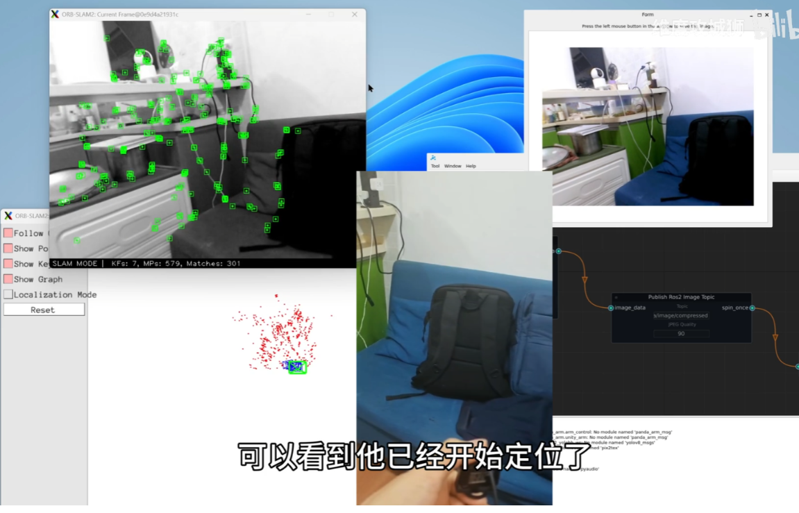

# 前言

在机器视觉与自主定位技术飞速发展的当下，**基于视觉的同步定位与地图构建（SLAM）技术已成为机器人导航、虚拟现实、智能驾驶等领域的核心支撑**。本项目介绍一些主流SLAM算法的实现与应用，旨在深入理解SLAM技术的原理与实现方式，并通过实际案例加深对SLAM技术的掌握。




更新：

- [2025-10-25:ORB-SLAM2真机移植测试！](https://www.bilibili.com/video/BV1MsxwzNEX9/?vd_source=3bf4271e80f39cfee030114782480463)
- [2025-10-6:测试ORB-SLAM2算法](https://www.bilibili.com/video/BV1bGxEz7E67/?vd_source=3bf4271e80f39cfee030114782480463)
- [2025-10-6:ORB-SLAM和ORB-SLAM2论文精读并测试运行ORB-SLAM2算法](https://blog.csdn.net/laoxue123456/article/details/152605959?spm=1011.2415.3001.5331)

# 环境搭建

[1、ORB-SLAM2编译环境搭建](docs/1.运行环境搭建/1、ORB-SLAM2编译环境搭建.md)

[2、GraphExecuter运行环境配置](docs/1.运行环境搭建/2、GraphExecuter运行环境配置.md)

# 运行测试

[运行测试](docs/1.运行环境搭建/3、运行测试.md)

## Qt软件

```shell
cd /root/workspace/slamsoftware/build/Desktop_Qt_6_9_2-Debug
./SlamSoftware
```


