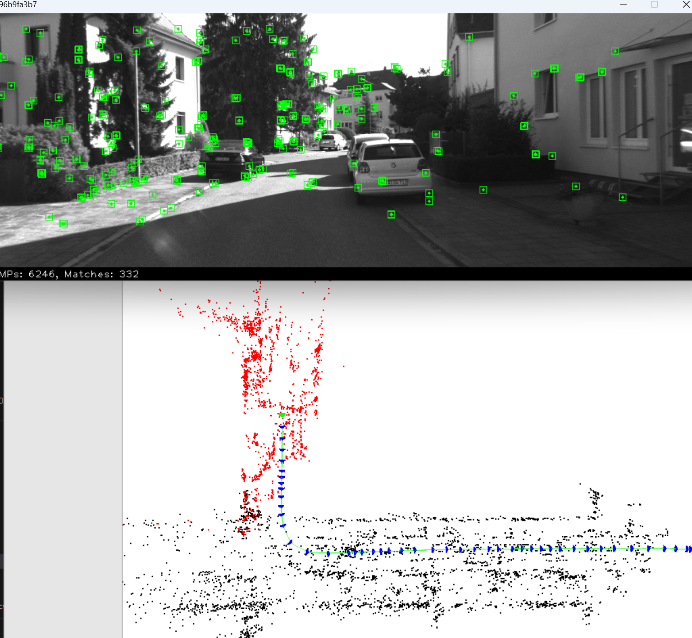

# 前言

最近项目需要用到SLAM技术，虽然可以把SLAM技术用起来，但是感觉存在很多技术疑问，并且在使用该技术的过程中，总会遇到不可描述的错误，究其原因还是对其原理技术和代码的理解不够透彻。因此，为了深入学习SLAM技术原理，决定开发一个软件。

# 环境搭建

[运行环境搭建](docs/1.运行环境搭建/运行环境搭建2.md)

# 运行测试

## Qt软件

```shell
cd /root/workspace/slamsoftware/build/Desktop_Qt_6_9_2-Debug
./SlamSoftware
```


## ORB-SLAM2

```shell
cd /root/workspace/slamsoftware/thirdparty/ORB_SLAM2
./Examples/Stereo/stereo_kitti ../Vocabulary/ORBvoc.txt Examples/Stereo/KITTI00-02.yaml /root/workspace/downloads/Kitti/sequences/00
```



